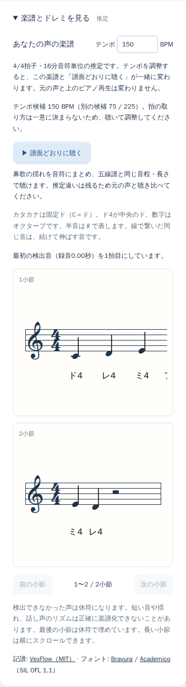

# 鼻歌の音符推定と譜面どおりのピアノ再生

比較元はPR #17の `d16c637`。利用者が「鼻歌をピアノで確認し、そのまま五線譜から演奏したい」という設計を承認したため、音高検出と音符・リズムへの解釈を分けた。Vite/TypeScript/Pages、原PCM・連続cents・従来の歌/話再生は維持。REQ-001〜013を維持し、REQ-014/015を追加。削除・保留はない。

## 今回の契約

歌声の音符列を整数鍵盤の候補から復元し、同じScoreを五線譜・カタカナ・「譜面どおりに聴く」へ渡す。タイは再打鍵せず、休符と同音再発音は区別する。テンポ変更も同じScoreへ反映する。従来の原音・連続音高ピアノは元の秒時計を保持し、譜面は0tickから全小節長の別時計で再生する。

これは音符推定と再生/記譜の一致の改善であり、今回の変更で元のHz検出精度が上がったとは扱わない。誤オクターブが長く続けば派生結果にも残る。現在の出力を「元の鼻歌を正確に演奏できる完成譜」とは評価していない。

## 方式比較

予備比較では、既知音高の27条件（3音域×3ビブラート幅×3速度、内部に100msの実オクターブ）を用いた。単純な時間方向の中央値、別鍵盤の持続時間を待つ方式、整数鍵盤列全体のコスト比較を試した。

| 方法 | 正しい3音列 / 27 | 100ms音の80ms以上が残らない例 |
| --- | ---: | ---: |
| 従来の鍵盤丸め | 9 | 12 |
| 中央値30 / 50 / 90 / 130ms | 9 / 9 / 12 / 15 | 12 / 6 / 9 / 6 |
| 小変化の持続50 / 70 / 90msを待つ | 12 / 12 / 12 | 9 / 9 / 9 |
| 音符列比較・変化コスト0.5 / 1 / 2 / 4 | 18 / 24 / 27 / 27 | 6 / 3 / 0 / 0 |

短音を残せた案のうち、変化への罰則が小さい2を採用した。波形の正解を多数決で決めたり、既知曲へ補正したりはしない。音符列の目的関数と制限は[仕様書](../仕様書.md)に記載。これらは調整/回帰集合であり、未知話者への汎化性能ではない。

## 最終の240条件

[全結果JSON](melody-results.json)。`scripts/benchmark-melody.ts`で従来の鍵盤丸めと同じ入力から比較する。

| 区分 | 条件数 | 音符列が一致：従来→今回 | 中央3時点の誤音合計：従来→今回 | 短音を50ms以上保持：従来→今回 |
| --- | ---: | ---: | ---: | ---: |
| 既知音高フレームから音符化 | 216 | 144→212 | 72→8 | 184→212 |
| 合成PCM→実際の停止後解析→音符化 | 24 | 16→24 | 4→0 | 20→24 |

フレーム条件は2音域、3揺れ幅、2速度、半音/全音/オクターブの上下、3位相。PCM条件は44.1/48kHz、2音域、半音/オクターブ上昇、3揺れ幅で、実際のYIN/Workerと同じ純粋解析関数を使う（この比較自体はNodeで実行）。従来の音符列が一致していた条件を今回不一致へ変えた例は0。

残る4条件は幅70c・4Hzの揺れと100msの小さい音程上昇が重なったもの。短音が消える/別音になる例がある。中心の鍵盤音を正解とした音符レベルの評価であり、連続F0のセント精度ではない。テンポ量子化後の最終Scoreはこの表の対象外で、短音省略は別に報告する。

別途、null休符・時刻欠落・uncertainを埋めない、100ms半音、原フレーム無変更、同音再発音をテストした。フレーム上の音量谷だけでは実際の80ms RMS窓で再発音を見落とす反例を発見し、直前100msの音量まで参照するよう修正。220Hzの同音で120msだけ振幅を20%へ下げた合成PCMは、全フレームvoicedのまま、従来1音→今回2音になった。回復1.09秒に対し区切り1.055秒（窓による約35msの差）。深いトレモロとの識別保証はない。

## 実録音

提供2録音はローカルだけで処理。識別情報、音声、個別推定フレーム、派生WAV/譜面画像はGit・PR・配布物に含めない。正解F0/音符境界のラベルはなく、数の減少を正解率とは呼ばない。

| 入力の歌声設定 | 従来の鍵盤丸め音符 | 今回の音符 | 記譜で省略 | 譜面の再生音符 |
| --- | ---: | ---: | ---: | ---: |
| 母音録音・現在の解析 | 8 | 6 | 1 | 5 |
| 追加歌唱・現在の解析 | 35 | 29 | 6 | 23 |
| 追加歌唱・前のモデル併用実験 | 31 | 27 | 5 | 22 |

両方式の歌唱を同じ音符抽出・同じ120 BPM・同じScore→本番ピアノschedulerに通してローカルWAVと5小節の五線譜を生成した。模型的な正解旋律で置き換えていない。モデル併用は引き続きアプリ未採用の比較用で、今回新しい学習モデル依存を追加していない。

提供録音はいずれもテンポの採用条件を満たさず、仮120を表示する。手動調整できるが、自由な鼻歌のテンポ復元を達成したとは扱わない。誤音・途切れ・記譜省略が残り、最終試聴/実演による利用者評価は未完了。元の検出器や有声判定は無変更のため、PJSの生F0再評価は今回繰り返していない。

## 再生・ブラウザ・レビュー

- 同じScoreで音高/休符/タイが一致、同音の再打鍵、譜面の末尾、テンポの変更をunitで検査。原音長を超える譜面も最後まで予約し、原音の第5引数指定は無視する。小節外tick、重複、小数MIDI等の不正入力を拒否する。
- Docker unit全75件成功後、実PCMの再発音を追加し、最終関連14件成功。
- Docker Chromium全22件中21件成功、1件は旧見出しと重複する説明文を探すテストのselectorで失敗。新見出し/実際の開閉操作へ修正し、該当の録音→再解析→原音→歌/話切替テストが成功。追加の譜面再生4件も成功。
- 375px/1280pxの再生ボタン・説明の親内収まり、ページ横overflow、SVGを実測し画像も目視。狭い画面の長い小節は従来どおり小節内スクロール。
- TypeScript/Vite build成功。既存VexFlow約728kB chunk警告は継続。
- ホストのCodex内ブラウザでlocalhostの新見出し/説明/操作表示を確認。実機マイクは使っていない。
- 独立レビューで不規則テンポの過信、同音再発音、小節外/小数MIDIの不整合を指摘され修正。自己レビューでは実波形とフレームの差も再現・修正した。



[1280pxの画面](screenshots/melody-1280.png)

## 性能・未検証・非対象

最終単回のDocker Node24/Linux arm64測定では、音符抽出のみで母音約4.54ms、約10秒の歌唱約5.83ms。60秒・6000フレーム・48半音を移動する人工列では約90.53ms。同時に比較処理も実行しており、専有CPUの性能保証ではない。F0解析、Worker、音声I/O、描画、実端末の時間は含まない。音符抽出は録音後にUI側で行うため、低速端末の長時間録音では応答性の実測が必要。

実機マイク、iPhone Safari/Android Chrome、OS電話中断、物理雑音、未知話者の正解音符付き精度、ピークメモリ、利用者による最終試聴と譜面からの実演は未検証。合成音・仮想マイクの成功で代用しない。調/拍子/弱起/三連符/自由なテンポ変動の完全復元、伴奏分離、MIDI/PDF出力は対象外。元の声が正しく採譜されるという受け入れ条件全体は未完了。

mainマージ、本番公開、Issue #13クローズは行わない。

## 再現

```sh
docker compose -f docker-compose.test.yml run --rm unit
docker compose -f docker-compose.test.yml run --rm unit node --experimental-strip-types scripts/benchmark-melody.ts
docker compose -f docker-compose.test.yml run --rm browser npx playwright test
docker compose -f docker-compose.test.yml run --rm browser npm run build
```

音源・合成マイクの準備はREADME参照。個人音声の再現スクリプトと入力は公開しない。受け入れ条件・非対象・リスク/対策・性能目標は[要件台帳](../要件定義書.md)にも保持する。
