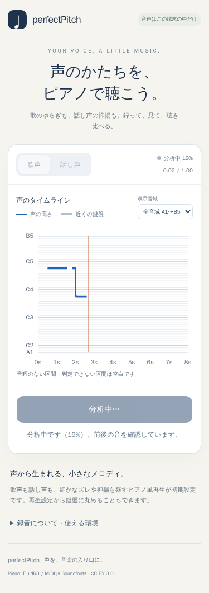

# 録音後の前後関係解析と途切れの再測定

比較元: PR #17 の `27f8c11`（1フレームの連続性比較を含む）。録音後に「分析中」で待つことを利用者が承認したため、ライブの暫定値と停止後の見直しを分けた。元PCM・録音時刻・Vite/TypeScript・Pages基盤は維持する。Issue #13全体の達成や完全な音程復元とは扱わない。

## 要件差分と選択

| 対象 | 状態 | 今回の扱い |
| --- | --- | --- |
| REQ-001〜012 | 維持 | 連続音高、短音、休符、楽譜、ローカル処理、検証条件を維持 |
| REQ-013 | 追加 | 録音後の待ち時間、前後の候補追跡、短窓再測定、実進捗、分析失敗時のPCM保持 |
| 保留・削除 | なし | 未検証を達成と読み替えない |

比較→回帰テスト→共有計算から候補取得→停止後Worker解析→進捗と失敗復帰→実録音/ブラウザ/レビューの順で実装した。受け入れ条件は短い実音・連続cents・PCM/時刻・無声を保持すること。非対象は正解メロディへの矯正、音声送信、マージ/公開。性能目標はDockerで10秒音声5秒以内、ライブの既存目標を維持。主リスクは実短音の消失と休符の誤復元で、波形証拠と短音保護を条件にした。

- [pYIN](https://webspace.eecs.qmul.ac.uk/s.e.dixon/pub/2014/MauchDixon-PYIN-ICASSP2014.pdf)既定設定と、[torchcrepe](https://github.com/maxrmorrison/torchcrepe)のtiny/full・候補単独/全区間ViterbiをDockerで比較した。提供歌唱のオクターブ変化が0になる案もあったが、既知の弱い基音や本物の100ms音を消す反例があった。単独置換は不採用。
- 学習モデルfullと波形候補の併用は前回の予備集合では有望だったが、約10.12秒の録音の推論だけで約26.99秒を要した。これはCPU2スレッドの単回計測で、ブラウザ性能ではない。ブラウザモデルの配布・速度は未検証で、今回は依存追加しない。
- 採用は既存YINの波形候補と弱い遷移コストによる録音後の追跡。無制約では336短音条件中13例で、従来30ms以上あった正解区間が30ms未満になったため不採用。30ms保護でも、雑音下で20msだけ残った低音を消す1例があった。最終版は**20ms以上・音高幅50c以内の観測を保持**する。長く安定している誤判定も残る代償がある。
- 不確実区間は最大80ms、両端の有声音高差2半音以内に限定し、40ms窓で全フレームを再検出する。周期性0.9以上、両端間の予測から75c以内、音量条件を満たした場合だけ再測定したHzを使う。silence/unvoicedは埋めず、予測値や前の音をコピーしない。回復後のperiodicityは40ms窓、rmsは元の80/60ms窓の測定値。

これらの条件を比較した集合は調整・回帰集合であり、未知話者への汎化精度ではない。

## 合成音の最終比較

両サンプルレート44.1/48kHz、歌/話し声、同じPCMと校正を使う実pipeline同士の比較。[全384条件のJSON](offline-results.json)。50c超誤差と未検出を別に数える。

| 条件 | mode | 50c超フレーム：比較元→停止後 | 未検出：比較元→停止後 |
| --- | --- | --- | --- |
| 周期強度変化24例 / 2376フレーム | 歌 | 580→561 | 2→0 |
| 周期強度変化24例 / 2376フレーム | 話 | 606→571 | 9→6 |
| 100ms実跳躍168例 / 中央504フレーム | 歌 | 65→65 | 19→19 |
| 同上 | 話 | 69→69 | 0→0 |

最終版では、100ms区間内の最長連続正解フレーム長が短くなった例は0/336。既存の未検出・誤判定は残る。中央フレームは0.84〜0.86秒、連続長は0.8〜0.9秒のフレーム中心から測る。これ自体はピアノ音符長ではなく、最終音符の短音保持は別のunit/browserテストで検査する。

低音82.41/98/220Hzと±30cを両サンプルレート・両モードで確認。既知の連続ビブラートの取りこぼし回復、無音/広帯域雑音の空白、実短音、PCM/時刻保持、実進捗、停止/キャンセル/失敗復帰も検証した。

## 実録音

提供2録音はローカルのみで評価した。個人音声・派生音声・個別フレーム・識別情報はGit/PR/配布物に含めない。正解F0はなく、下表を正解率としない。

| 提供録音 | mode | 隣接オクターブ変化 | 連続再生の区間数 | 再検出した不確実区間 |
| --- | --- | --- | --- | --- |
| 母音 | 歌 | 0→0 | 5→5 | 1区間 / 6フレーム |
| 母音 | 話 | 0→0 | 6→6 | 0 |
| 追加歌唱 | 歌 | 11→9 | 26→23 | 4区間 / 7フレーム |
| 追加歌唱 | 話 | 22→16 | 30→29 | 2区間 / 2フレーム |

母音の従来有声だったフレームの音高は両modeで完全一致。隣接オクターブ変化は連続有声フレーム間の1200±60c差の件数で、無声をまたぐ変化は数えない。区間数は正解の楽譜音符数ではない。長い下方誤判定と途切れはなお残る。最終実装の結果を本番ピアノschedulerでWAV生成し、試聴可能にした。利用者の最終聴感は未確認。

提供歌唱約10.12秒の停止後解析はDocker Node24/Linux arm64で歌約3.92秒・話約2.67秒、母音約6.41秒は約2.53/1.65秒。単回計測で、同時に比較処理を実行していたため厳密な専有CPU性能ではない。10秒5秒以内の目標はこの環境の測定では満たすが、実端末・60秒録音・ピークメモリの性能保証ではない。

許諾済みPJS6録音も、校正用0.4秒無音あり/元音声の両条件で再評価した。出典・許諾は[既存記録](real-audio-sources.md)のまま。無音前置条件の「有声フレーム数 / 連続区間数」は次のとおり。

| 音源 | 有声フレーム数 | 連続区間数 |
| --- | --- | --- |
| PJS056 歌 | 510→560 | 40→31 |
| PJS012 歌 | 735→805 | 39→20 |
| PJS068 歌 | 324→342 | 29→24 |
| PJS087 歌 | 860→930 | 57→38 |
| PJS091 歌 | 167→174 | 13→12 |
| PJS056 話 | 105→105 | 12→12 |

PJSにも正解F0がなく、増えた有声判定がすべて正しいとは断定しない。通常話声の有声割合約16.9%という限界は残る。

## ブラウザ・自動検証・レビュー

- Docker unit全61件成功後、20ms保護を含む停止後解析の関連6件を再実行し成功。追加の低音/±30cケースも通過。
- Docker Chromium全18件成功後、最終の20ms保護に対して関連3件を再実行し成功。AudioWorklet→Worker、暫定/確定の同じ時刻、分析進捗、分析失敗後の原音再生/再試行を確認。最終ビルドも成功。既存VexFlow chunk約728kBの警告は継続。
- 375pxの分析中画面を撮影・画像を目視確認。状態文とボタンが収まり、無効化と進捗が表示される。1280px等の既存画面・楽譜は全suiteの回帰確認に含む。
- ホストのCodex内ブラウザでlocalhost版の表示、歌/話の切替、画像を確認。マイクは使用していない。
- 自己レビューと独立レビューで修正必須の指摘なし。独立レビューの追加合成確認は8kHz・110/220/440Hz・両mode・5〜40ms無音の42条件で、新たに無音中心を有声へ復元する退行なし。最終版では短音保護をさらに強めた。



実機マイク、iPhone Safari/Android Chrome、電話等のOS中断、物理雑音、複数話者の正解F0付き精度、60秒録音の最終解析負荷、最終版の利用者による聴感は未検証。Dockerの仮想マイクや合成MediaStreamを実機確認とは扱わない。全ブラウザ行列・Lighthouse・公開URL smokeは今回行わず、端末互換性/公開判断時に実施する。mainマージ・本番公開・Issueクローズは行わない。

## 再現コマンド

```sh
docker compose -f docker-compose.test.yml run --rm unit
docker compose -f docker-compose.test.yml run --rm unit node --experimental-strip-types scripts/benchmark-offline.ts
docker compose -f docker-compose.test.yml run --rm unit node --experimental-strip-types scripts/evaluate-real-audio.ts output/offline-pjs.json --offline
docker compose -f docker-compose.test.yml run --rm browser
```

PJSとピアノの取得手順は既存README/出典資料に記載。比較のパッケージ/モデル取得はDocker内で行い、個人音声の推論時はネットワークを無効化した。探索Pythonスクリプトとモデルは配布物に含めず、製品にPythonや学習モデル依存を追加していない。
