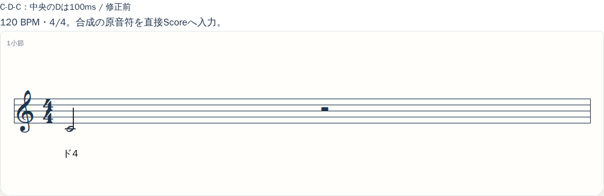
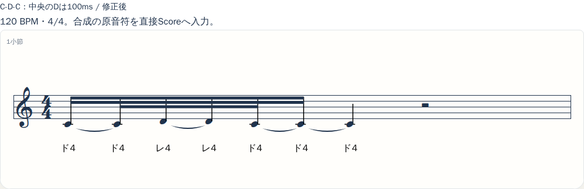
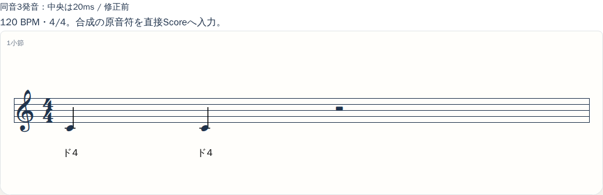
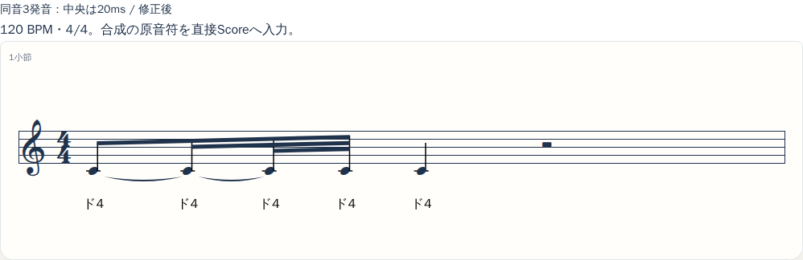
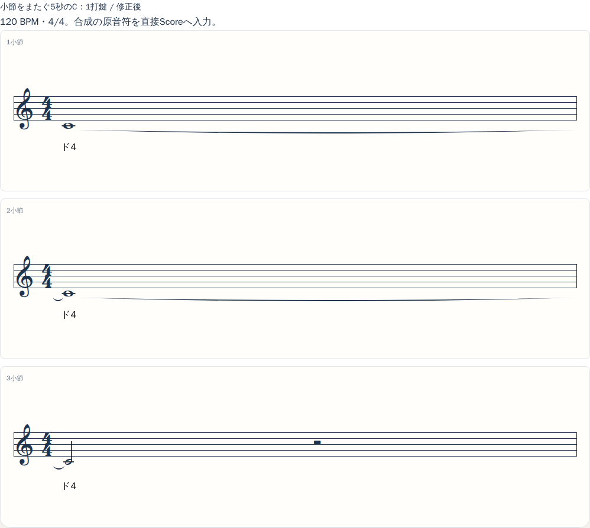

# 検出済み短音・同音再発音のScore保持（Issue #22）

120 BPMのC4–D4–C4（中央D4は100ms）が、修正前のC4一音から、表示・譜面ピアノ・MIDIとも3発音になった。検出器は変更していない。4/4、手動BPM 40〜240を維持する。

## 出発点と原因

- 着手時のmain: `ea97ade49ee8ec87029a8cc895f4a0eb1d8fb5b6`。PR #24は2026-09-08 14:47:37 UTCにマージ済みで、レビュー済みhead `77b5a95b5020cda78c3eee60c05ba8f4c78e3c1c`とPR #23の解析修正を含む。このmainから専用ブランチを作成した。
- baselineの単体テスト188件とbuild成功を記録した後、実`buildScore`をimportするC-D-Cテストを追加。旧コードでは期待`[60,62,60]`に対し`[60]`となる失敗を確認した。
- 旧Scoreは四分音符4tick。開始と終了の独立した16分音符丸めでD4がゼロ長になり、省略後に前後のC4を結合していた。MIDIも480PPQのヘッダーとは別に、この粗い単位へ再丸めしていた。

## 時間・発音の契約

原PCM/F0 → 原音秒のPerformanceNotes → 拍時計のScore → 五線譜・カタカナ・譜面ピアノ・MIDI、という関係を維持した。通常ピアノ・連続音高再生には変更を加えていない。

| 対象 | 新しい契約 |
|---|---|
| 内部Score | 480PPQ、4拍1920tick。表示最小単位とは別 |
| 記譜 | 全〜128分音符（1920〜15tick）。配置可能な最大の整列音価から分割する |
| 丸め | 音符・休符の共有境界を共同探索。16→32→64→128分の順で、全境界を原音時刻±50ms以内へ置ける最も粗いグリッドを選ぶ |
| 独立発音 | `sourceNotes[].sourceId` → 論理音符 → 各`ScoreEvent.sourceId`。同じ音高でも別IDを結合しない |
| タイ | 同じ発音を音価・小節で分割した断片だけを接続。再生は1打鍵 |
| 休符 | 原音に正の間隔があれば正のScore間隔を確保。浮動小数点の算術誤差以外の間隔を消さない |
| MIDI | 論理音符の整数tickを直接480PPQへ変換。新Scoreからのtick丸め誤差0。同時刻はnote-offをnote-onより先に出力 |
| MIDIテンポ | 四分音符のマイクロ秒を最近整数へ丸めるため、最大0.5µs/拍（60秒・240 BPMで最大120µs）。終端は最後の小節末尾 |
| 原音との対応 | `origin`は最初の有効検出音の原音秒。原音符・contourをコピーして保持し、入力を変更しない |
| BPMと編集 | 自動譜面は原音秒から再量子化。編集後は音価を維持して速度変更。原音は伸縮しない |
| 編集 | 1/32拍単位。内部tick列を入力させない。元IDを保持し、手動追加へ架空の元IDを付けない |
| 旧Score | `ppq`省略は旧4PPQとして解釈、未知の単位は拒否。保存機能は追加しない |

128分音符は40 BPMで46.875ms、120 BPMで15.625ms、240 BPMで7.8125ms。これは表示最小音価であり、任意密度の入力を必ず正確に配置できる保証ではない。各境界を原時刻から探索するため、後続音符を順番に押し出す累積ずれを作らない。

入力の負時刻・非有限値・不正音高・非正長・範囲外・重なりは、対象IDと理由を残して未配置件数へ計上する。durationを越えた終端はその理由と元の終了秒を保持して範囲内へ切る。最短音価より短い音/休符も要確認として示す。±50msと正長を同時に守れない密集区間では、有効入力全体を未配置とし、原音符を保持する。休符だけの編集用譜面から手動追加できるが、全音未配置を成功とは扱わず、発音がない間は再生も無効にする。案内は自動推定時の記録として残り、手直しだけで過去の警告を消さない。

## 合成の比較材料

全例120 BPM。下記画像とMIDIは小さな合成成果物としてGitへ収録した。375px版も同じディレクトリにある。[manifest](score-preservation/manifest.json)には入力、Score、実再生予約、音源・コード・WAV/MIDIのhashを記録している。

| ケース | 原音秒 | 修正前の打鍵 | 修正後の打鍵 |
|---|---|---|---|
| C-D-C | C:0–.2 / D:.2–.3 / C:.3–1 | C:0–1の1回 | C:0–.1875 / D:.1875–.3125 / C:.3125–1の3回 |
| 同音再発音 | C:0–.46 / C:.46–.48 / C:.48–1 | 中央が消失し2回 | 0–.4375 / .4375–.5 / .5–1の3回 |
| 小節をまたぐ長音 | C:0–5 | 3小節のタイ、1回 | 3小節のタイ、1回 |

### C-D-C

修正前：



修正後：



[旧MIDI](score-preservation/cdc-before.mid) / [新MIDI](score-preservation/cdc-after.mid) / [375px](score-preservation/cdc-after-375.png)

### 同音再発音





[旧MIDI](score-preservation/reattack-before.mid) / [新MIDI](score-preservation/reattack-after.mid)

### 小節をまたぐ長音




[旧MIDI](score-preservation/long-before.mid) / [新MIDI](score-preservation/long-after.mid)

譜面ピアノWAVは、製品のFluidR3_GMサンプルと`schedulePianoVoice`をOfflineAudioContextで実行した合成成果物。`rate=1`、ループなし、長音の自然減衰も製品と同じ。6 WAV・12 PNG・6 MIDIを比較HTMLとZIPでローカル保存し、音声をGitへ追加していない。音源はBenjamin Gleitzman配布のFluidR3_GM（CC BY 3.0 US、既存製品の帰属表示を維持）。この検証は主観的な聴感評価や物理スピーカー確認を表さない。

## 歴史的holdoutによる回帰比較

対象は#24が公開済みのfinal holdout 14曲 × YIN/Basic Pitch。今回完全未使用の未知データとは呼ばない。同じ保存済みPerformanceNotesを旧新版へ渡し、再推論・データ再収集はしていない。[公開比較JSON](score-preservation-results.json)の全28行に旧指標、新ID指標、A1/A2別の採点を保持している。

| 指標（14曲合計、旧→新） | YIN | Basic Pitch |
|---|---:|---:|
| 入力音符 | 809 | 519 |
| 論理打鍵 | 622 → 809 | 507 → 519 |
| 消失（既存の重なり指標） | 187 → 0 | 12 → 0 |
| omittedNotes | 173 → 0 | 11 → 0 |
| 余計な追加（旧指標） | 0 → 0 | 0 → 0 |
| 同音再発音の消失（旧指標） | 14 → 0 | 0 → 0 |
| 偽の休符・秒 | 24.040 → 8.986 | 15.531 → 7.007 |
| 原音符間休符の誤占有・秒 | 11.602 → 4.411 | 4.942 → 1.956 |
| 表示イベント（休符含む） | 1290 → 2481 | 1110 → 1724 |
| 最大開始誤差・ms | 60.0 → 47.5 | 62.341 → 40.723 |
| 最大終了誤差・ms | 310.0 → 50.0 | 803.740 → 48.259 |

旧時間誤差は旧指標が対応づけたペアに限定するため、消失音符の誤差は含まれない。新版では元IDとの対応でも測り、全1328発音の正長MIDI出力を独立SMF parserで確認した。IDに基づく消失・追加・余計な再打鍵・音高変更・同音再発音消失はすべて0。IDが残るだけで成功にせず、Score断片の長さ・音高・再生論理音符と、MIDIのnote-on/off時刻を照合した。

短すぎる原休符の要確認はYIN 9件、Basic Pitch 4件残る。発音保持の`preserved`と、要確認も0である`pass`を分離し、今回の比較要約は`preserved:true`、`pass:false`を表示する。これは比較報告の品質フラグであり、実行コマンドやテストの失敗ではない。省略0を無条件の完全成功とは扱わない。

| A1/A2×14曲のmacro F1（%） | YIN onset / offset | Basic Pitch onset / offset |
|---|---:|---:|
| 記譜前Performance（不変） | 49.04 / 37.70 | 59.33 / 31.06 |
| 旧Score | 41.88 / 26.60 | 46.42 / 21.45 |
| 新Score | 47.13 / 34.95 | 56.72 / 30.08 |

これは検出済み音符の損失が減った結果であり、検出器が音響的に正しくなったという主張ではない。推定器の誤音も以前より残る。

### 出典の照合

- 保存run：`output/issue21/final-holdout`、推論baselineは`e1f2bbda77097f2b1e807566d64717211bbcd426`。
- 元raw SHA-256：`f4d59d1bd5113666e07ce0223009961fa127e33110a82b0b51d3df0809d7886d`。#24の公開JSONのhashへ照合した。
- 元holdout seal参照：`3f382f5b665b4cd818e0665c528fecd8eb543d40b2bb6ccf474604a57a2bcd90`。旧baseline/raw/sealは変更せず、新コードのsourceHashesと環境を新しい比較結果へ記録した。
- manifest、14曲の完了状態、音声hashの参照、A1/A2 CSVを確認し、保存Scoreの旧コード再生成・保存譜面再生・A1/A2の記譜前後指標を元rawと照合した。
- 元runではstageファイルを個別sealしていなかった。stage hashは今回記録したもので、原推論時点の個別sealを後付けしたものではない。保存stageの照合可能な範囲は上記の再生成と既存指標まで。

## 実行した検証

- 単体テスト：208件。40/80/120/180/240 BPM、100ms、連続短音、半音/オクターブ、境界±1ms、先頭/末尾/小節境界、2〜4同音、5〜10秒長音、100/400ms休符、入力不変、旧単位、不正/密集/微小間隔、履歴・ID診断を含む。
- 製品buildと評価用TypeScript型検査。buildには既存のVexFlowチャンクサイズ警告が残る。
- 関連Chromium 24件（譜面・編集・旋律・推論切替・ピアノ・ファイル入力）が成功。その後のレビュー修正は譜面関連12件と、最後の案内分岐を含む7件で再確認した。
- 375px/1280pxで短音・カタカナ・タイを実描画、選択、編集→Undo→Redo、削除→同内容追加→自動推定へ戻す、MIDIダウンロード、実Web Audioの予約を確認。画像自体を目視し、SVG内部の右端/下端とページ幅も測定した。
- 通常のファイル入力に短い合成WAVを投入。観測した検出音はC .395–.595 / D .615–.695 / C .725–1.425秒で、Score後も3発音を維持した。検出境界とScore丸めを別々に保存した。
- 60秒600音で単体の変換・編集・MIDIは1秒未満、Chromiumの末尾4小節描画と編集UI生成は5秒未満（代表実測約43ms）。全音の最小音価化を避けた長音の描画も確認した。実測値は環境依存でベンチマーク保証ではない。
- 独立レビューの指摘により、固定1e-8秒の境界許容を算術誤差相当へ縮小、duration超過の案内追加、同内容再挿入の由来変更を履歴へ反映、旧4PPQの評価換算、全音未配置時の再生状態、評価要約を修正し関連テストを再実行した。

既存テストは削除していない。`score.test.ts`のtick期待は480PPQへ換算し、短音省略の期待を正長保持＋要確認へ更新。`score-playback.test.ts`の省略後同音結合期待を3発音保持へ変更。`humming-evaluation.test.ts`は旧C-D-C消失の診断を残して新版の消失0を追加した。独立MIDI parserは既存テストから共通helperへ移動し、出力を別実装で読む性質を維持した。

### 再実行コマンド

開発実行はDocker内。依存インストールはコンテナvolume、生成物は無視対象の`output/`へ置く。以下は既存評価入力・音源fixture・旧コードexportを用意済みの環境で実行する。保存入力がない環境では合成の単体/ブラウザ検証を実施できるが、歴史的比較を実施済みと扱わない。

```sh
docker compose -f docker-compose.test.yml run --rm unit npm test
docker compose run --rm build
docker compose -f docker-compose.test.yml run --rm browser sh -lc 'npm ci && node scripts/create-test-voice.mjs && node scripts/fetch-piano-fixture.mjs && npx playwright test tests/browser/score.spec.ts tests/browser/score-editing.spec.ts tests/browser/score-preservation.spec.ts tests/browser/melody.spec.ts tests/browser/transcription.spec.ts tests/browser/piano-output.spec.ts tests/browser/audio-import.spec.ts'
docker compose -f docker-compose.test.yml run --rm browser npx tsc -p scripts/evaluation/tsconfig.json
docker compose -f docker-compose.test.yml run --rm browser node --experimental-strip-types scripts/evaluation/compare-score.ts output/issue21/final-holdout output/issue22/comparison-new output/issue22/baseline
docker compose -f docker-compose.test.yml run --rm browser node --experimental-strip-types scripts/evaluation/score-artifacts.ts output/issue22/artifacts-new output/issue22/baseline
```

baseline exportは`ea97ade`の`src/notation/{score,score-playback,midi}.ts`と`src/ui/score-renderer.ts`を同じ相対パスで保持し、rootの`sha.txt`へ完全SHAを記録する。比較/成果物コマンドは出力先が既に存在すると拒否する。比較では旧コードhashも元rawへ照合する。

## 残る課題と範囲

受け入れ条件は、既知C-D-Cと扱える独立発音が正長で表示・再生・MIDIへ届き、休符・タイ・編集・原音時計を壊さないこと。最小音価と誤差制約に収まらない入力は対象・理由を示して修正可能にする。密集入力の性能目標は上記の1秒/5秒で検証した。

非対象は検出器/モデル/有声判定、音響的境界の全面改修、新しい拍子・完全な自動テンポ/調/弱起推定、UI全面改装、バックエンド/課金。リスクは誤検出音も保持すること、表示イベント増、最短音価以下の要確認であり、原音との比較・手編集・最大音価優先・件数/理由の開示で対処する。

#22の後続には、音響的な短音/再発音の検出精度、過密入力の部分救済、付点/連符等の読みやすい記譜、拍・弱起・テンポの推定、第三者による演奏可能性評価が残る。今回は#22全体や鼻歌から完全自動で演奏可能な楽譜の達成とは扱わない。

物理マイク、実iPhone、第三者の楽器演奏、主観的聴感は未実施。新規モデル推論、全ブラウザmatrix、Lighthouse、公開URL smokeは検出器・レイアウト基盤・公開を変更していないため追加実行していない。公開時、対応ブラウザ変更時、解析器変更時には該当するgateを再実行する。PRのみ作成し、マージ・本番公開・Issueの自動クローズはしない。
