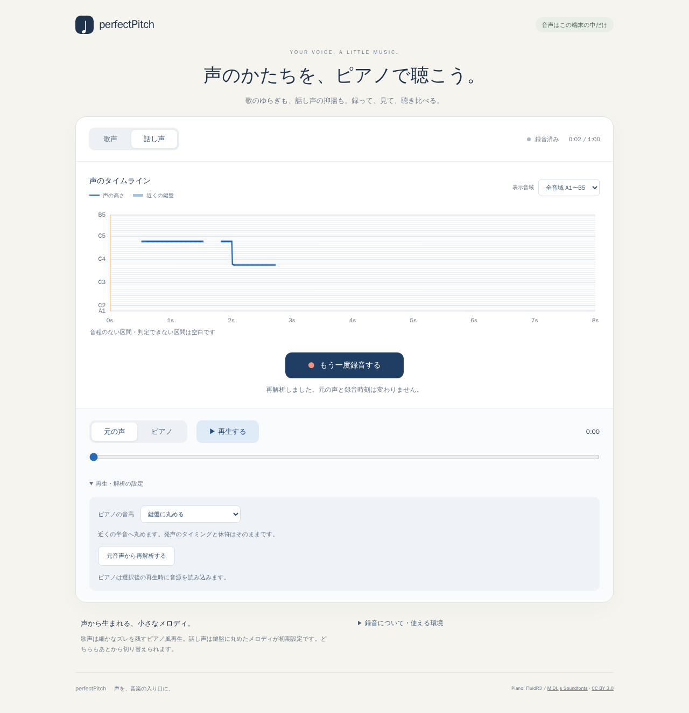
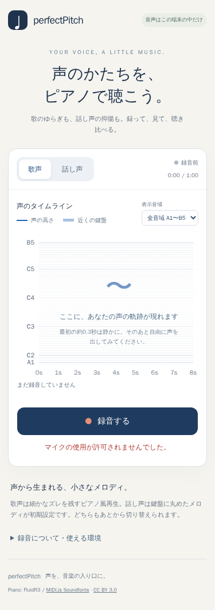

# 検証報告 — Issue #13

以下は初版PR #14の検証記録。楽譜追加は [score-verification.md](score-verification.md)、倍音誤り・分断修正は [pitch-continuity.md](pitch-continuity.md)、録音後の前後関係解析・分析待ちの最新評価は [offline-review.md](offline-review.md) を参照。

このPRは全受け入れ条件を達成したリリースではない。実装・自動検証・限定した実録音評価までをレビュー可能にし、残る実機/精度/聴感評価を明示する。

## 合成音と比較

[synthetic-report.md](synthetic-report.md) と [synthetic-results.json](synthetic-results.json) が固定seedの旧/YIN/MPM比較。

同じ80ms窓の検出器単体では、旧→採用YINでp95絶対誤差4995.24→0.288 cents、50c超12.50→0%、非周期入力の周波数返却75→0%、CPU p95 2.133→1.998ms。旧UIの閾値/平滑化までを再現したアプリ全体の比較ではない。歌80ms/話60ms、10ms hopを採用。実測CPUはDocker Node24で音声入出力/転送/描画を含まない。

±30 cents、82.41/98/220/440Hzを含む低音と倍音/位相/振幅/44.1/48kHz、100ms短音、実オクターブ跳躍、休符、非周期雑音を検証。最初の正解フレームが利用可能になる短音/跳躍の因果遅延は歌40〜80ms、話40〜60ms。旧UI全体の追従遅延と実端末CPU/電池/熱は未計測。

**10dB SNRではYIN80msもp95約66.93 cents・50c超20.83%で目標未達。** 強い雑音下の精度改善を達成済みと扱わない。20dB条件はp95約3.42cだが、物理環境雑音の実測ではない。

## 実録音評価

[出典・利用許諾](real-audio-sources.md)、[評価報告](real-audio-evaluation.md)、[数値](real-audio-results.json)、[再現スクリプト](../../scripts/evaluate-real-audio.ts)。PJSの歌5件と通常日本語話声1件、同一話者、48kHz/24bit/mono。公式に再利用を許諾された録音を使用。音声はGitと公開Artifactに含めない。

全6件が解析・音符化を例外なく完走。0.4秒デジタル無音を前置して校正を分離した条件と元WAV条件を比較。デジタル無音は物理的な部屋の校正を代替しない。新有声割合は歌25.7〜40.9%、話16.9%。話声1.05秒相当から24/29音（連続/丸め）が生成され、自然な音符区切りと取りこぼしは継続評価が必要。

正解F0/有声ラベルがないため、有声割合は検出率でも精度でもない。旧方式の追加受理が誤検出か回収かを断定しない。楽譜上の音高を演唱の正解ラベルとみなさない。

## ブラウザ確認の区別

- Docker Chromium: 合成WAVを仮想マイクに入力。AudioWorklet→Worker→停止後PCM再解析→原音/ピアノ再生を確認する自動テスト。
- OfflineAudioContext: 生成されたPCMの持続/音高/終了を測定。スピーカー出力や人間の聴感評価ではない。
- ホストCodex内ブラウザ: ページ表示、歌/話切替、スクリーンショットを目視。物理マイクの録音は行っていない。
- 375×812: デスクトップChromiumのviewport変更。iPhone Safari/Android実機とは別。
- 中断通知の注入と境界テスト: アプリの停止処理を検証するもの。電話着信やOSバックグラウンド制限の実測ではない。

## 自己・独立レビューで修正する回帰

旧コードの検出器ピーク選択・整数丸め・rAF依存・100ms音符化を再確認し、再現テストを追加。モバイル下端の録音ボタン見切れを境界計測で再現し、通常フロー内の余白とCanvas高さを調整。録音の許可待ちキャンセル、同期resume、最終PCM ack、60秒到達、Worker/Workletエラー、停止/再解析キャンセルをテスト。

独立レビューのR1（約3.13秒サンプル枯渇による長音途切れ）、R2（停止後に音源取得が始まる）、R3（音源読込中の音声中断）の修正と再検証を記録する。

## 未検証・未達（残る受け入れ条件）

- iPhone Safari / Android Chrome / ホスト主要デスクトップブラウザの実マイク許可から入出力、電話等OS中断と復帰、長時間メモリ/CPU。
- 同意済み複数話者の低/高声、普通の会話、静室/定常音/突発音の正解ラベル付き検出率・誤検出率・cents精度。
- テレビ/伴奏/他話者が混ざる物理環境の限界評価。周期音源分離は非目標。
- 実録音をピアノ化した聴感、短い抑揚と境界の自然さ。数値だけで完成と判断しない。
- 30/60/120fpsを実端末で切り替えた比較。純粋解析のchunk同値と描画停止中の録音経路のテストとは区別。
- Worklet/Workerの端末別負荷比較、MP3音源のSafari/Androidデコード。
- 録音末尾の約半窓分と窓混合による音符の短縮。正確なonset/offset検出は保証しない。
- 強雑音10dB SNRの精度目標未達。対処として無音化しただけで改善とみなさない。

## 重いGate

全実機、Firefox/WebKitマトリクス、Lighthouse/性能/全viewport、公開URL smokeは未実行。公開依頼がなく、実機も利用できないため。公開判断前に上記未検証、代表エンジン、実機CPU/メモリと中断を実行する。既存Pages workflowとbaseは無変更で、本番へ反映しない。

## 実行証拠（2026-09-06）

| 区分 | コマンド/方法 | 結果 |
| --- | --- | --- |
| 旧基準ビルド | `docker compose run --rm build` (b67b836) | 成功 |
| 新解析・録音・再生回帰 | `docker compose -f docker-compose.test.yml run --rm unit` | 36/36成功（subtestsを含む） |
| UI/入出力統合 | Docker `playwright test tests/browser/studio.spec.ts` | 5/5成功、合成WAV仮想マイク |
| ピアノ実出力 | Docker `playwright test tests/browser/piano-output.spec.ts` | 2/2成功、OfflineAudioContext |
| 実音声取得・評価 | `fetch-evaluation-audio.py` / `evaluate-real-audio.ts` | 6件完走、全SHA検証。正解なし |
| Python検査 | Docker一時環境の`ruff check` / `mypy --strict` | 取得スクリプト両方成功 |
| 依存監査 | Docker `npm audit` | high 5件→許容範囲内更新後0件 |
| ホストUI | Codex内ブラウザ | ページ表示・モード切替・画像目視。マイクなし |

ピアノ出力テストは200msの正弦サンプルを本番schedulerで4.1秒発音し、3.8〜4.0秒区間のRMS約0.1378を確認。実測+30c=447.69105Hz、-30c=432.44105Hz、丸め=440Hz、後半octave glide=879.999995Hz。終端後PCMは0。音楽サンプルそのもののチューニングや聴感品質を保証する試験ではない。

R1はattack後の持続区間（最大0.35〜1.3秒、sample長の25〜75%）をゼロ交差に合わせてループし、末尾10msをcrossfadeする処理で対応。R2/R3は各await後の世代確認とloading中のcontext状態監視で対応。長音の持続サンプル加工に伴う聴感は追加評価対象。

### UI証拠

Docker Chromiumで撮影した画像を実際に目視確認。375×812の録音ボタン右端/下端がviewport内、横overflowなし。1280×720でも録音ボタンの下端がviewport内。再生設定は内容の高さで展開するため、停止後の下部へは通常スクロールする。

独立レビューは修正後の限定再確認でR1/R2/R3すべて解消、新たな重大不具合なしと判定。再レビューは静的確認で、上記テスト実行と区別する。最終Vite 7.3.6 / TypeScriptの本番ビルドもDocker Node20で成功。main公開workflowとVite baseの差分は0。

最終本番Artifactもローカルpreviewで確認: `TEST_PREVIEW=1 playwright test tests/browser/studio.spec.ts -g 音源失敗` 1/1成功。`/perfectPitch/`下のWorklet/Workerロード、録音→停止→音源失敗→再試行→ピアノ→再録音を通過。GitHub Pagesの公開URLは未実行。

## 後続変更について

本書はリニューアルPR #14の検証記録です。同PRは後続のユーザー承認でマージ・自動公開済みですが、実声精度・実機確認等の未完了条件は継続しています。追加の楽譜・固定ド表示は [score-verification.md](score-verification.md) に分けて記録します。
