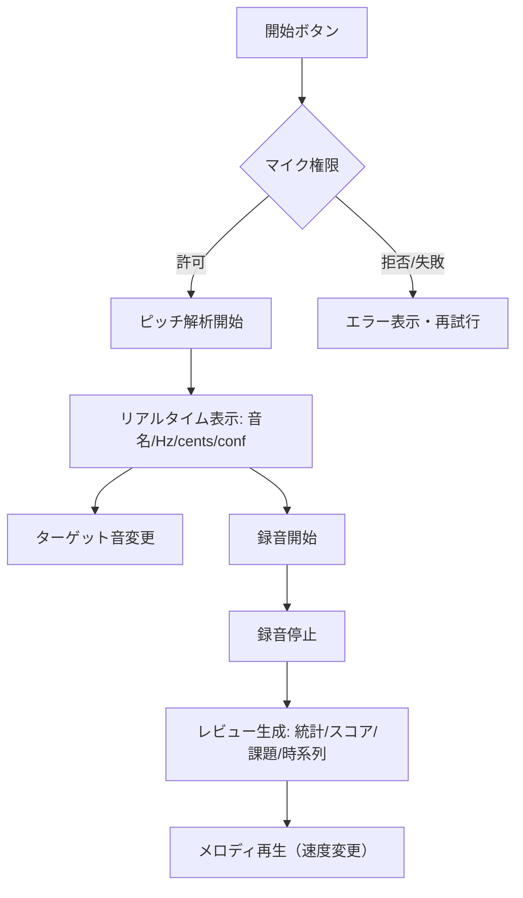

# 機能一覧（perfectPitch）

## 昨日の説明（要約）
この会話では「昨日の説明」が提供されていないため、現状の `README.md` と `src/main.ts` の実装から **MVPの挙動** を要約しています。

## 機能一覧
- **ピッチ推定**: マイク入力から音名 / Hz / cents / confidence を推定して表示
- **ターゲット指定**: ターゲット音を選択し、ターゲットとの差（cents）を表示
- **ゲージ表示**: ターゲットとの差を -50¢〜+50¢ の範囲で可視化
- **基準音再生**: ターゲット音（および1オク下）を再生
- **録音**: 録音→停止→再生
- **録音の振り返り**: 簡易統計、スコア、課題、時系列（cents）表示、テキスト一覧
- **メロディ再生**: 録音結果を簡易メロディとして再生（速度変更）
- **入力チューニング**: マイク感度と音程取得速度をスライダーで調整（デフォルトは生活音環境向け）
- **デバッグ表示**: 波形サンプルのプレビュー表示
- **UIデザイン書き出し**: `.pen`ファイルにUIを書き出し（`design/perfectPitch-ui.pen`）

## フロー図（Mermaid）

